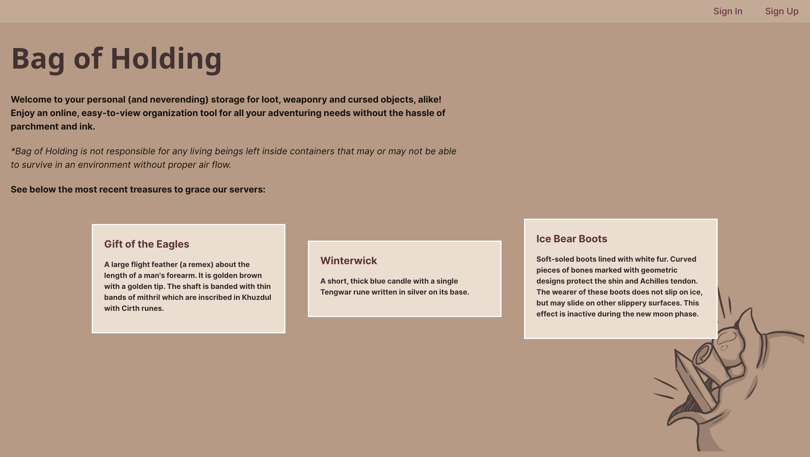
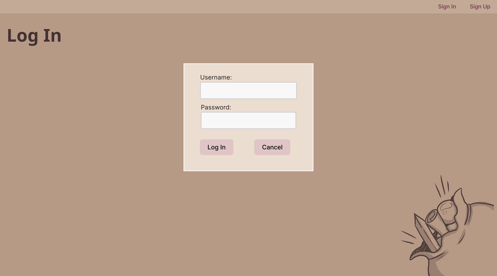
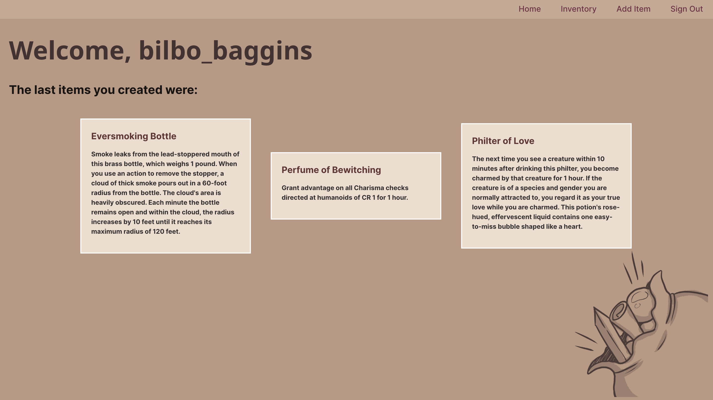
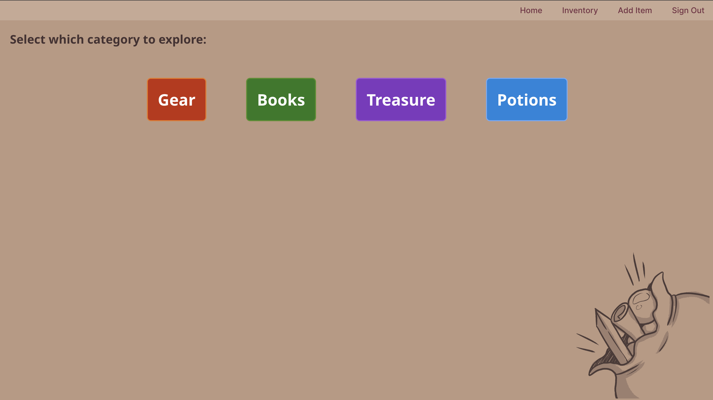
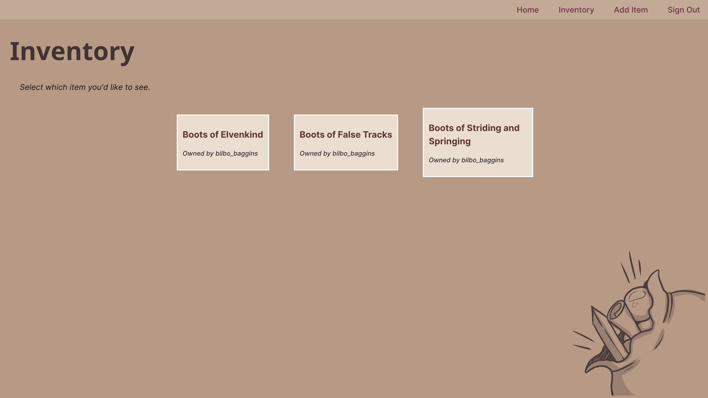
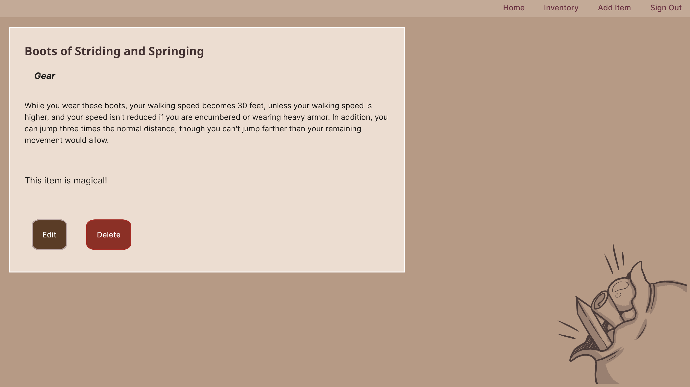

  

  

  # Bag of Holding

  ### [TRELLO LINK](https://trello.com/b/eE2BVWT9/bag-of-holding-project-3-planning)

  ##### Melissa Griffin

  ## :pouch: Description

 "Bag of Holding" is a new way to keep track of your loot from games like Dungeons and Dragons or other tabletops! It provides an easy-to-view inventory divided into categories to help you keep count of all the treasure you've gained in your adventures!

  

## Screenshots 

  |   Description | Screenshot | 
  |:-------------:| -----------|
  | <h3>Home Screen</h3> |  |
  | <h3>Sign In Page</h3> |  |
  | <h3>User Dashboard</h3> |  |
  | <h3>Categories of Items</h3> |  |
  | <h3>List from "Gear" Category</h3> |  |
   | <h3>Item Details</h3> |  |

  ## :computer: Technologies Used

  
  
  
  
  
  
  
  
  
  

## :crystal_ball: Getting Started

  
 User Guide

    1. Sign Up to create a username and password for your personal inventory.

    2. Navigate to the Inventory page and click which category you'd like to view.

    3. Click "Add Item" in the nav bar to add more to your inventory.

    4. Use the "Edit" or "Delete" buttons to make any changes to items you've made.

  
Deployed Link (Heroku)

  <a href=""
    >Bag of Holding</a
  >

## :construction: Upcoming Features

- :white_square_button: Graphics Updates

- :white_square_button: Community Hub, allow users to see other users inventories

- :white_square_button: User Profiles